### Epic Unreal 5 File Associations & Visual Studio Solution Files

<sub>[home](../README.md#user-content-ue4-hello-world)</sub>


When installing unreal often the links to the .uproject are not set up properly.  Having installed this on hundreds of computers this is an ongoing issue. Here are some strategies to fixing it especially if you need to create a Visual Studio solution file. 

Go directly to **STEP 5.** as this is the best solution.
<br>

---


##### `Step 1.`\|`UE5FASLNS`|🔹

If you have a blank page next to your Unreal 5 `.uproject` file then you will not be able to double click and launch the engine.

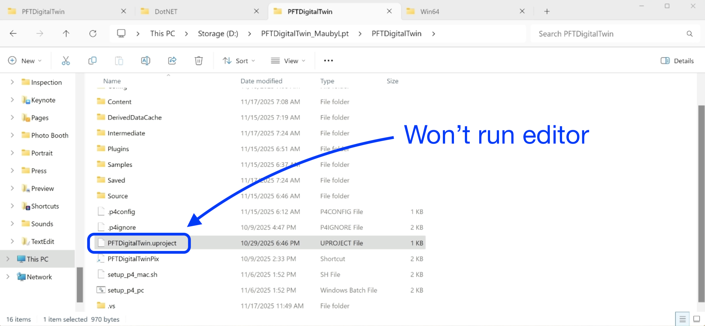


##### `Step 2.`\|`P4VUE5`|🔹🔹

Right click on the `.uproject` file and select **Open with** then in the next pop up if there is no **Unreal** icon then select **Choose another app**. If there is still no Unreal app then select **Choose an app on your PC**. 

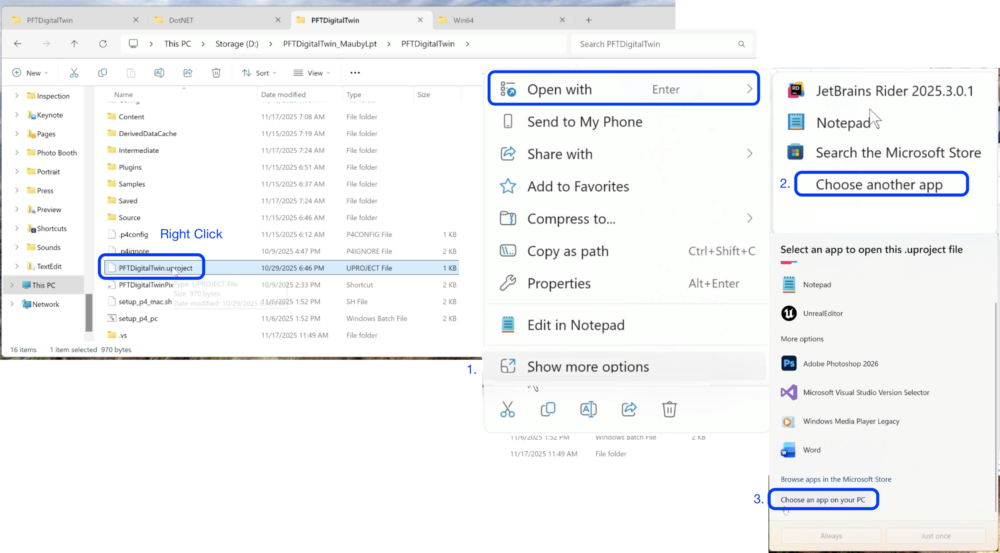


##### `Step 3.`\|`P4VUE5`|🔹🔹🔹

Select `UnrealEditor.exe` and select **Open**.  On the pop-up select **Always** to lock in Unreal editor.

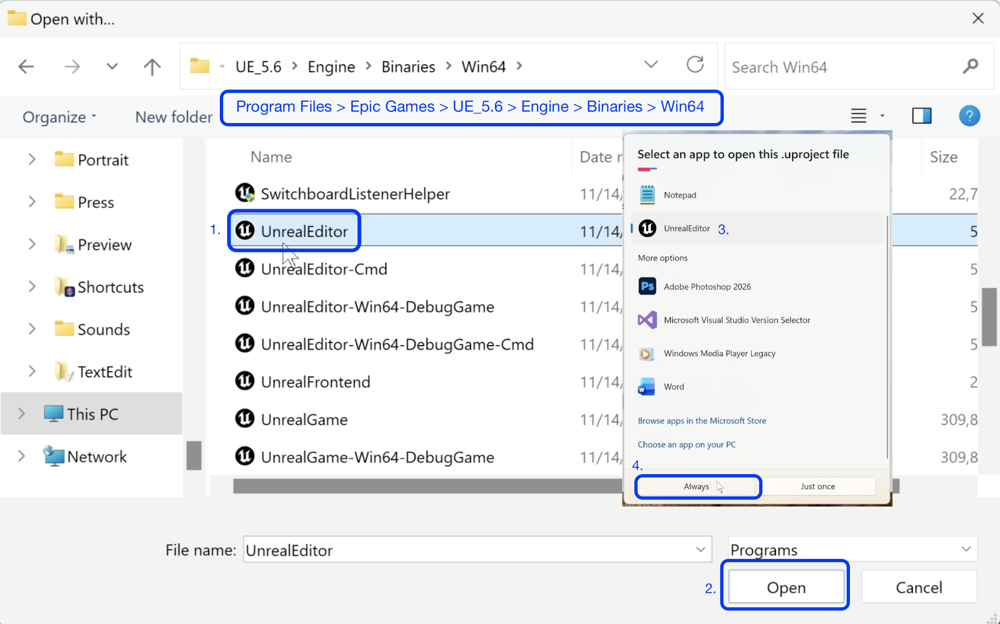


##### `Step 4.`\|`P4VUE5`|🔹🔹🔹🔹

Now you see a link to the Unreal editor using the black **U** logo that is tied to that specific version of the engine.  There are two problems, if you have multiple versions of the engine the wrong one will try and load the project and there is no context menu to generate a Visual Studio solution file.  For that we need to run it through the 

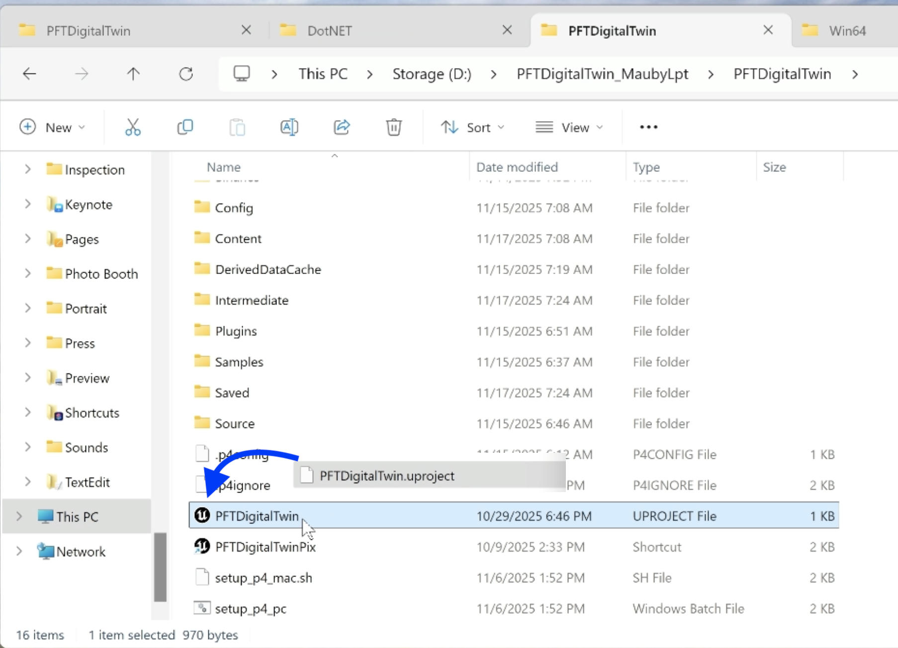


##### `Step 5.`\|`P4VUE5`| 🔸

So for it to work better, automatically pick the correct installed version of Unreal and give you the context menu to generate visual studio files and more go to `Program Files > Epic Game > Launcher > Engine > Binaries > Win64` and copy to your clipboard the `UnrealVersionSelector` app. 

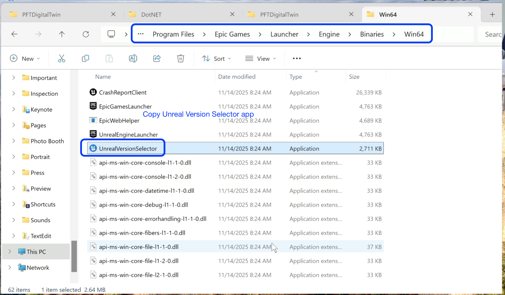


##### `Step 6.`\|`P4VUE5`| 🔸🔹

Go to `Program Files > Epic Game > UE_5.X > Engine > Binaries > Win64` and paste the file there.  Right click on `UnrealVersionSelector` and select **Run as administrator**. You will get a pop up that says to register the directory as an Unreal Engine installation.  Select **Yes**.  If it is succesful it will say **Registration Successful**.

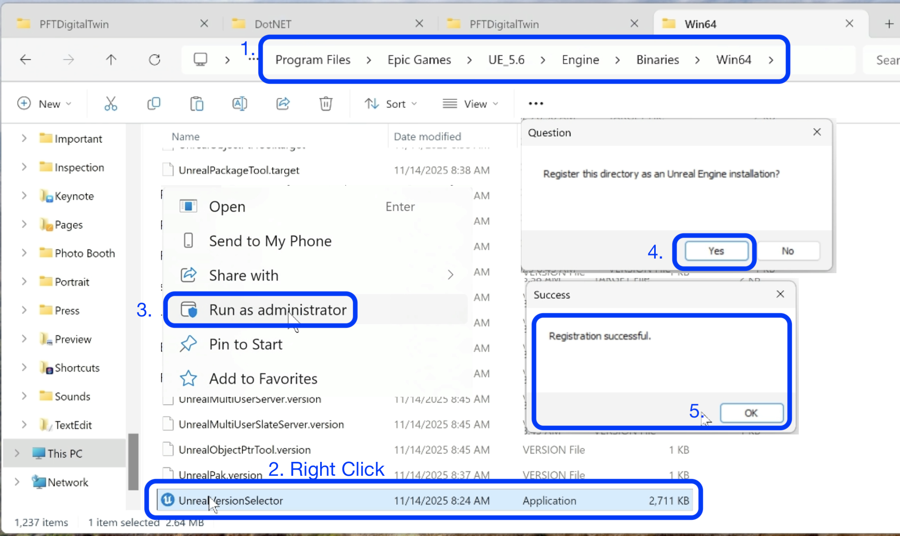


##### `Step 7.`\|`P4VUE5`| 🔸🔹🔹

Now right click on your `.uproject` file and select **PFTDigitalTwin** - then select **Choose another app** so you can relink it to this new executable.

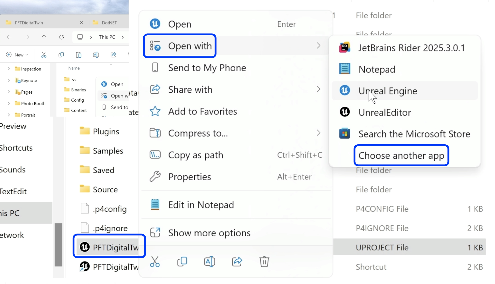


##### `Step 8.`\|`P4VUE5`| 🔸🔹🔹🔹

Now select the blue icon for Unreal Engine that points to the **UnrealVersionSelector** app. Select **Always**.  Now you should have a blue icon.

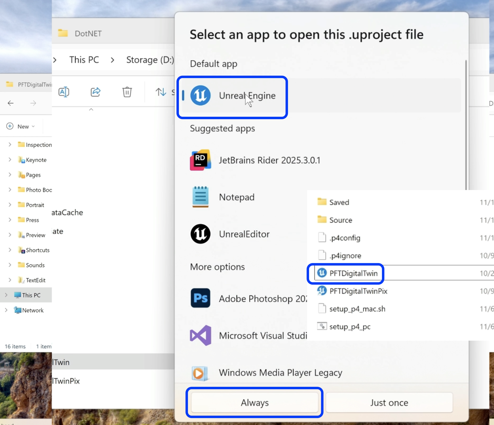


##### `Step 9.`\|`P4VUE5`| 🔸🔹🔹🔹🔹

Now that we have the blue icon we also might want to generate a solution file for our C++ project. So the first method for creating a solution file is to right click the blue `.uproject` file and select **More options**.  Then select **Generate Visual Studio project files**. Wait a bit and you should get a visual studio solution.

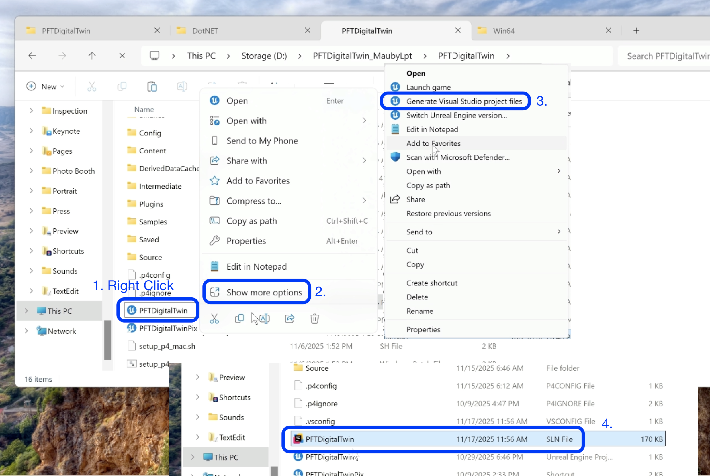


##### `Step 10.`\|`P4VUE5`| 🔷

The second way to create a visual solution file and project files is through the editor.  So if you have a valid set of binaries and can just launch the game directly without going into your **IDE**, then launch the game - then select **Tools > Generate Visual Studio Project**. This will effectively do the same thing.

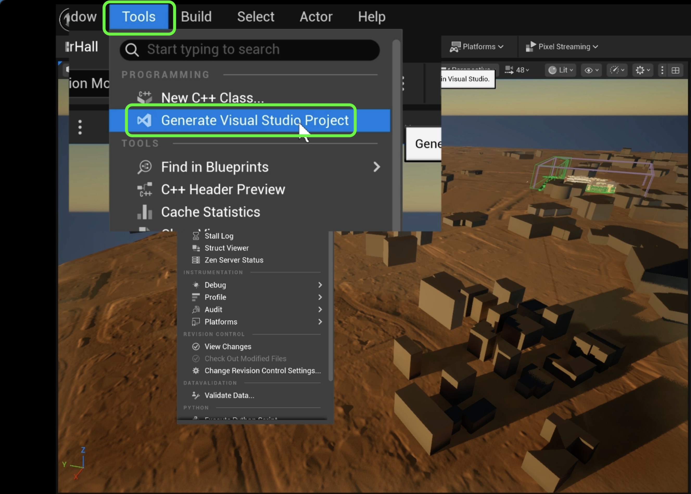


##### `Step 11.`\|`P4VUE5`| 🔷🔹

The final solution is to run it through command prompt.  Go to **Windows > R** then select **Command Prompt**.  Navigae to `C:\Program Files\Epic Games\ UE_5.X\Engine\DontNET\UnrealBuildTools\. The add: N

```
.\UnrealBuildTool.exe -projectfiles -project="D\\Location\for\ProjectName.uproject" -game -engine` and run it in command prompt.
```
Right click on it then copy your full project path to your `uproject` file then replace the project location above.

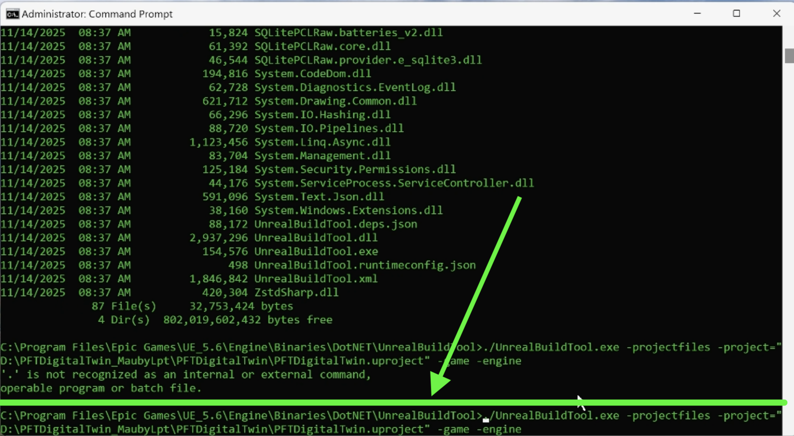


___


| [home](../README.md#user-content-ue4-hello-world)|
|---|
